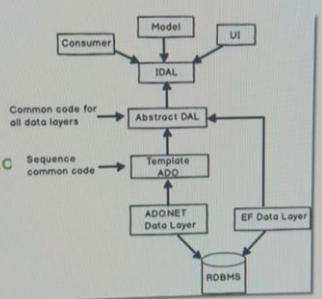
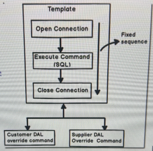

# Walkthrough: Dependency Injection vs DalFactory for Data Access

## Navigation
- [Changes Made](#changes-made)
    - [1. Extracted Generic Repository Interface (Repository Pattern)](#1-extracted-generic-repository-interface-repository-pattern)
    - [2. BaseRepository Implementation (Template Method Pattern)](#2-baserepository-implementation-template-method-pattern)
    - [3. Implemented Constructor Injection (DI)](#3-implemented-constructor-injection-di)
    - [4. Configured Composition Root](#4-configured-composition-root)
- [Alternative: Abstract Factory Pattern (DalFactory)](#alternative-abstract-factory-pattern-dalfactory)
- [Deep Analysis: DI vs Factory](#deep-analysis-di-vs-factory)

---

---

I have implemented Dependency Injection (DI) to handle Data Access Layer (DAL) resolution. This completely decouples the UI from concrete database implementations like `AdoRepository`.

### System Architecture Overview



> [!NOTE]
> **Why this Architecture is Helpful:**
> - **Independence**: The UI and Middle Layer only depend on `IDAL` (Interfaces), meaning you can swap the entire database logic without touching the UI.
> - **Scalability**: New data providers (like EF or Dapper) can be added as separate plugins to the `Abstract DAL`.
> - **Note-taking Tip**: Visualizing the flow from `Consumer` -> `IDAL` -> `Concrete DAL` helps in understanding where the "Inversion of Control" actually happens.

## Changes Made

### 1. Extracted Generic Repository Interface (Repository Pattern)
The [IRepository.cs](../InterfaceDAL/IRepository.cs) in the `InterfaceDAL` ensures all data access follows a standard contract. The UI only references this abstraction, not concrete SQL logic.
```csharp
public interface IRepository<T> where T : class
{
    void Add(T entity);
    // ...
}
```

> [!NOTE]
> **What the Repository Pattern Solves:**
> - **Separation of Concerns:** It hides the complex logic required to access data (Database, APIs, file systems) from the business logic or UI.
> - **Centralization:** All queries and data manipulation are centralized, meaning if a database schema changes, you only update the repository, not the UI.
> - **Testability:** It makes Unit Testing the UI very easy by allowing you to mock `IRepository` without needing a real database.

[↑ Back to top](#navigation)

### 2. BaseRepository Implementation (Template Method Pattern)
Inside the `Repository` project, there is a `BaseRepository<T>` that implements standard workflows for CRUD operations, but defers the actual execution to abstract methods like `ExecuteAdd(T entity)`. Concrete classes like `AdoRepository` provide the specific ADO.NET logic for these methods.

#### Template Method Workflow



> [!NOTE]
> **What the Template Method Pattern Solves:**
> - **Code Duplication:** It defines the "skeleton" of an algorithm (e.g., establishing connection string, exception handling logging) in the base class, so `AdoRepository` and `DapperRepository` don't have to rewrite the same common boilerplate.
> - **Enforced Workflow:** It guarantees that all child classes execute certain steps in a specific order (the template), while allowing subclasses to override the specific steps.
> - **Predictability**: Developers know exactly where to plug in custom logic (the "override" points) without worrying about the connection management or error handling.

[↑ Back to top](#navigation)

### 3. Implemented Constructor Injection (DI)
The UI `FormCustomer` now accepts `IRepository<ICustomer>` through its constructor rather than using the `new` keyword to create `AdoRepository`.
```csharp
private readonly IRepository<ICustomer> _repository;

public FormCustomer(IRepository<ICustomer> repository)
{
    InitializeComponent();
    _repository = repository;
}

// In btnAdd_Click:
_repository.Add(cust); // The Form never needs to know what database is being used!
```
[↑ Back to top](#navigation)

### 4. Configured Composition Root
The dependency is configured and injected at the entry point of the application in [Program.cs](./Program.cs). This is the only place in the entire application that knows about the concrete `AdoRepository`.
```csharp
InterfaceDAL.IRepository<InterfaceLayer.ICustomer> repository = 
    new Repository.AdoRepository<InterfaceLayer.ICustomer>(connStr);

Application.Run(new FormCustomer(repository));
```
[↑ Back to top](#navigation)

## Alternative: Abstract Factory Pattern (DalFactory)

If you prefer to avoid constructor injection, an alternative is creating a `DalFactory`. This acts similarly to the `CustomerFactory`.

```csharp
public static class RepositoryFactory<T> where T : class
{
    public static IRepository<T> Create(string dalType, string connectionString)
    {
        if (dalType == "ADO") return new AdoRepository<T>(connectionString);
        else if (dalType == "Dapper") return new DapperRepository<T>(connectionString);
        throw new ArgumentException("Invalid Data Access Type specified.");
    }
}
```
The UI would then call it like this: `IRepository<ICustomer> repo = DalFactory.RepositoryFactory<ICustomer>.Create("ADO", connStr);`

[↑ Back to top](#navigation)

> [!IMPORTANT]
> **Deep Analysis: DI vs Factory**
> 
> 1. **Dependency Injection (Recommended)**: This is the industry standard approach (SOLID principles). It forces you to declare a class's dependencies directly in its constructor, avoiding hidden parameters. This is essential for Unit Testing because you can inject a "mock" database repository when testing the UI.
> 2. **Factory Pattern**: Best for when the exact object being created changes during runtime based on complex logic (e.g., dynamically changing from ADO to Dapper at the click of a button). However, it requires you to pass configuration variables (like the `connectionString`) from the UI into the factory whenever the UI needs to access the database, adding noise to the UI layer.
> 
> **Why use this pattern here?** If you switch from `ADO.NET` to `Dapper` down the road, you never have to recompile or modify the WindowsForm project.

> [!TIP]
> **Validation Results**
> The UI now successfully saves customers to the database using the injected generic repository. The `WindowsForm` project no longer requires a project reference to the concrete `Repository` project containing SQL logic.
